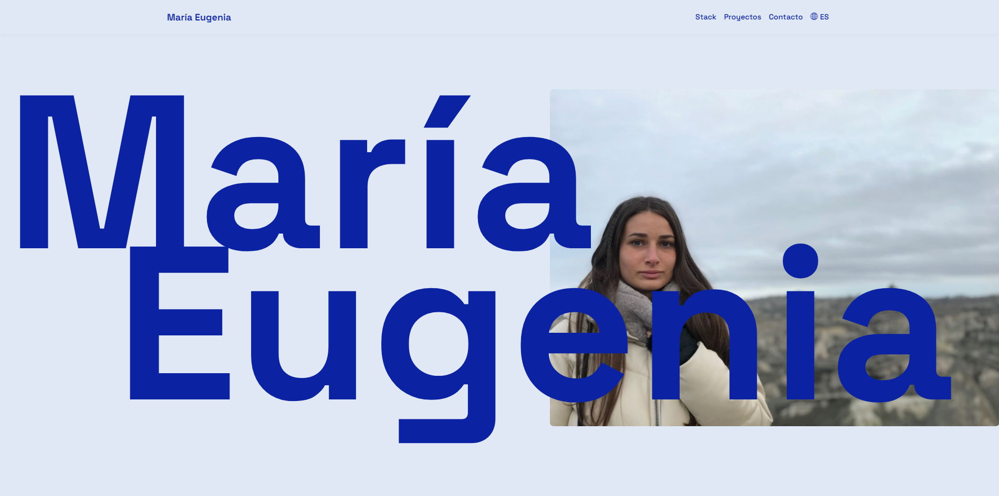

# Hi! I'm Maria Eugenia 👋
### Digital Frontend designer and developer, with knowledge in Backend and React Native.

I'm a digital designer specializing in Web and Apps, graduated from Universidad ORT in 2024. 

Currently seeking opportunities to join a development company where I can apply my knowledge and continue growing professionally. I am motivated to keep learning and contribute meaningfully to innovative projects. 

I'm excited about the possibility of being part of a team that values growth and continuous learning, where I can bring my creativity and technical skills!

## Tech Stack:

# Featured Projects:

## Quest Parking

 

## Nova Tech

## Shio Gourmet

## Taurus Arcade

## Palarino Portfolio

